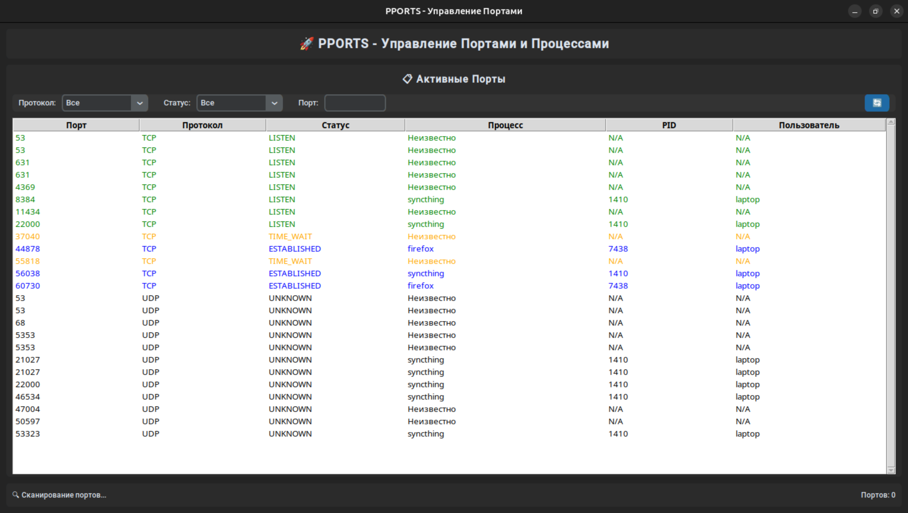
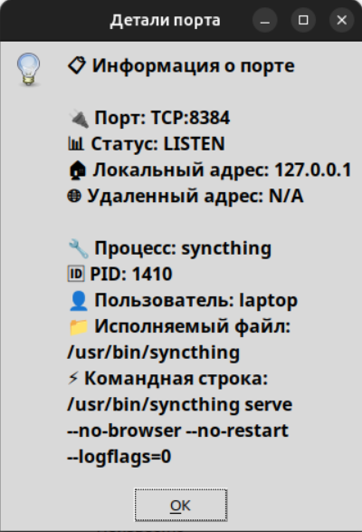
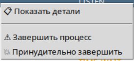
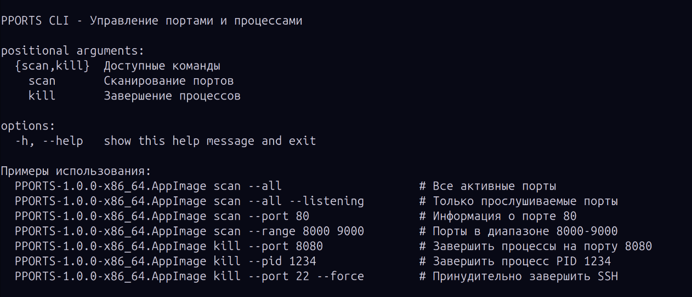

<div align="center">

# 🚀 PPORTS

**Графический и CLI инструмент для мониторинга сетевых портов и управления процессами**

[](https://python.org)
[](LICENSE)
[](https://linux.org)
[](https://github.com/vebulogmetra/pports)

</div>

---

## ✨ Основные возможности

<table>
<tr>
<td width="50%">

### 🖥️ **GUI Интерфейс**
- 📊 Отображение портов в таблице
- 🔍 Фильтрация и поиск
- 🔄 Автообновление списка
- ⚠️ Безопасное завершение процессов
- 🛡️ Защита системных процессов
- 🎨 Современная темная тема

</td>
<td width="50%">

### 💻 **CLI Интерфейс**
- 📊 Сканирование портов
- 🔍 Поиск по номеру порта
- 📈 Диапазоны портов
- ⚠️ Управление процессами
- 🛡️ Встроенная безопасность
- 🚀 Быстрая работа

</td>
</tr>
</table>

---

## 🖼️ Скриншоты

<div align="center">

### 🏠 Главное окно приложения


*Главный интерфейс с таблицей активных портов, фильтрами и элементами управления*

---

### 🔍 Детальная информация о порте  


*Подробная информация о выбранном порте и связанном процессе*

---

### 🖥️ Контекстное меню


*Контекстное меню с действиями для управления процессами*

---

### 💻 CLI интерфейс


*Консольный интерфейс для системных администраторов*

</div>

---

## ⚡ Быстрый старт

<details>
<summary><b>🐧 Linux (Ubuntu/Debian)</b></summary>

```bash
# 1. Скачать готовый AppImage
wget https://github.com/vebulogmetra/pports/releases/download/v1.0.0/PPORTS-1.0.0-x86_64.AppImage

# 2. Сделать исполняемым
chmod +x PPORTS-1.0.0-x86_64.AppImage

# 3. Запустить
./PPORTS-1.0.0-x86_64.AppImage
```

</details>

<details>
<summary><b>🛠️ Установка из исходников</b></summary>

```bash
# 1. Клонировать репозиторий
git clone https://github.com/vebulogmetra/pports.git
cd pports

# 2. Создать виртуальное окружение
python3 -m venv .venv
source .venv/bin/activate

# 3. Установить зависимости
pip install -r requirements.txt

# 4. Запустить GUI
make run

# Или CLI
make run-cli
```

</details>

---

## 📚 Использование

### 🖥️ Графический интерфейс

```bash
# Запуск GUI (основной способ)
./PPORTS-1.0.0-x86_64.AppImage

# Или из исходников
make run
```

**Основные функции:**
- **Фильтрация**: Используйте выпадающие списки для фильтрации по протоколу и статусу
- **Поиск**: Введите номер порта или имя процесса в поле поиска
- **Контекстное меню**: Щелкните правой кнопкой мыши на строке для действий
- **Обновление**: Нажмите кнопку "Обновить" или используйте автообновление

### 💻 Командная строка

<details>
<summary><b>Примеры команд CLI</b></summary>

```bash
# Показать все активные порты
pports-cli scan --all

# Только прослушиваемые порты
pports-cli scan --listening

# Найти информацию о порте 80
pports-cli scan --port 80

# Сканировать диапазон портов
pports-cli scan --range 8000 9000

# Завершить процесс на порту 8080
pports-cli kill --port 8080

# Завершить процесс по PID
pports-cli kill --pid 1234

# Принудительное завершение (SIGKILL)
pports-cli kill --port 22 --force
```

</details>

---

## 🔒 Безопасность

PPORTS заботится о безопасности вашей системы:

<table>
<tr>
<td>🛡️</td>
<td><strong>Защита системных процессов</strong><br>Автоматически определяет и защищает критически важные процессы</td>
</tr>
<tr>
<td>⚠️</td>
<td><strong>Подтверждение операций</strong><br>Запрашивает подтверждение перед завершением процессов</td>
</tr>
<tr>
<td>🚦</td>
<td><strong>Мягкое завершение</strong><br>Сначала отправляет SIGTERM, затем при необходимости SIGKILL</td>
</tr>
<tr>
<td>🔐</td>
<td><strong>Защищенные порты</strong><br>Особая осторожность с SSH (22), HTTP/HTTPS (80/443) и другими</td>
</tr>
</table>

---

## 🏗️ Сборка и разработка

<details>
<summary><b>🔨 Сборка из исходников</b></summary>

```bash
# Клонировать репозиторий
git clone https://github.com/vebulogmetra/pports.git
cd pports

# Установить зависимости для сборки
make install-build

# Создать AppImage
make appimage

# Полная сборка с тестированием
make release
```

</details>

<details>
<summary><b>👨‍💻 Настройка для разработки</b></summary>

```bash
# Установка окружения разработки
make dev-install

# Запуск тестов
make test

# Форматирование кода
make format

# Проверка кода
make lint

# Очистка временных файлов
make clean
```

</details>

### 📁 Структура проекта

```
pports/
├── 📂 src/                    # Исходный код
│   ├── 📂 core/               # Основная логика
│   │   ├── port_scanner.py    # Сканирование портов
│   │   └── process_manager.py # Управление процессами
│   ├── 📂 gui/                # Графический интерфейс
│   │   └── main_window.py     # Главное окно
│   ├── cli.py                 # CLI интерфейс
│   └── main.py                # Точка входа
├── 📂 assets/                 # Ресурсы
│   ├── pports.svg             # Иконка приложения
│   ├── pports.desktop         # Desktop файл
│   └── 📂 screenshots/        # Скриншоты для README
├── 📂 memory-bank/            # Документация разработки
├── 📄 requirements.txt        # Зависимости
├── 📄 Makefile               # Команды сборки
└── 📄 setup.py               # Конфигурация пакета
```

---

## ⚙️ Технические детали

### 🔧 Технологии

<div align="center">


</div>

- **Python 3.8+** — основной язык разработки
- **psutil** — кроссплатформенная библиотека для работы с процессами
- **CustomTkinter** — современный GUI фреймворк с темной темой
- **AppImage** — портативная упаковка для Linux

### 🏛️ Архитектура

- **Модульная структура** с четким разделением ответственности
- **Асинхронные операции** для отзывчивого интерфейса
- **Кроссплатформенность** (готовность к Windows/macOS)
- **MVC паттерн** для GUI компонентов

---

## 🤝 Сообщество

### 🐛 Сообщить об ошибке
Нашли баг? [Создайте issue](https://github.com/vebulogmetra/pports/issues/new?template=bug_report.md)

### 💡 Предложить функцию  
Есть идея? [Предложите функцию](https://github.com/vebulogmetra/pports/issues/new?template=feature_request.md)

### 🔄 Внести вклад
1. 🍴 Форкните репозиторий
2. 🌟 Создайте ветку (`git checkout -b feature/amazing-feature`)
3. ✍️ Внесите изменения и закоммитьте
4. 📤 Запушьте (`git push origin feature/amazing-feature`)
5. 🔄 Создайте Pull Request

---

## 📄 Лицензия

<div align="center">

Этот проект лицензирован под **MIT License**

[](LICENSE)

*Свободное использование, модификация и распространение*

</div>

---

## 👨‍💻 Автор

<div align="center">

**vebulogmetra**

[](https://github.com/vebulogmetra)
[](mailto:vebulogmetra@yandex.ru)

</div>

---

<div align="center">

### ⭐ Если проект полезен, поставьте звезду

</div> 